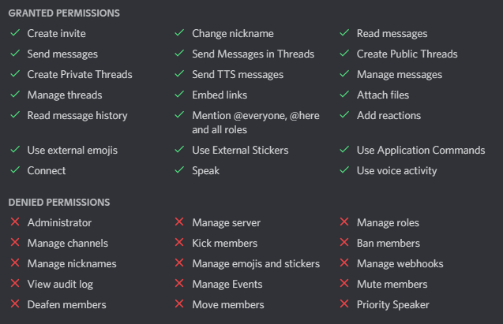

# Setup

* Copy and edit the Dist-Files
  *  settings-private.properties.dist
    * insert your tokens
  * application.properties
    * update your urls which are used for oauth with spotify
    * ports must not be changed since you can map them via docker
* `docker-compose up -d` will build and run the bot

# Notes for Aiode Permissions

`https://discord.com/oauth2/authorize?client_id=__CLIENTID__&permissions=532680277057&scope=bot`

